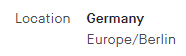
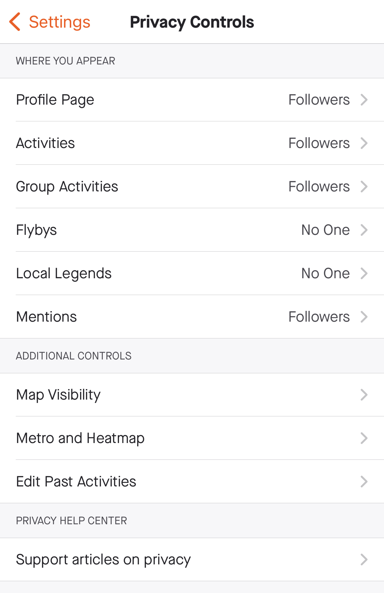
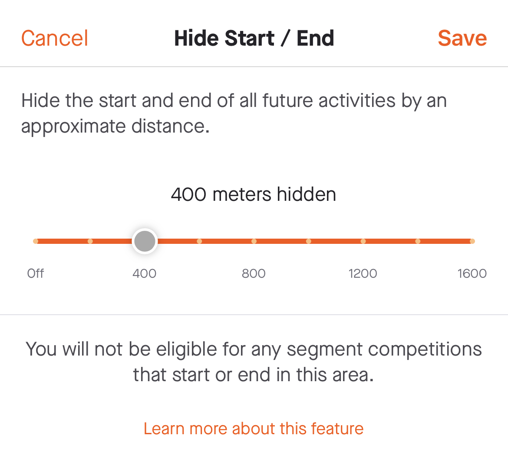
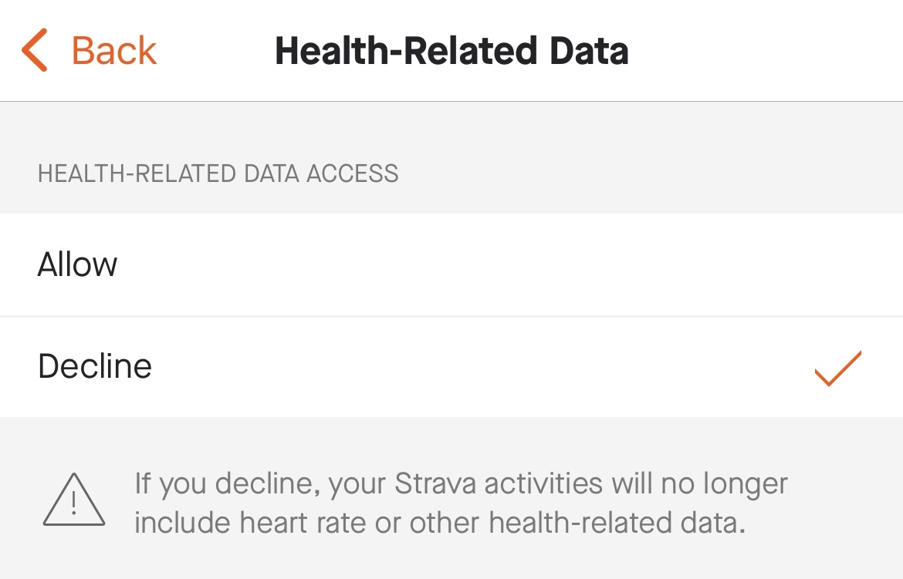
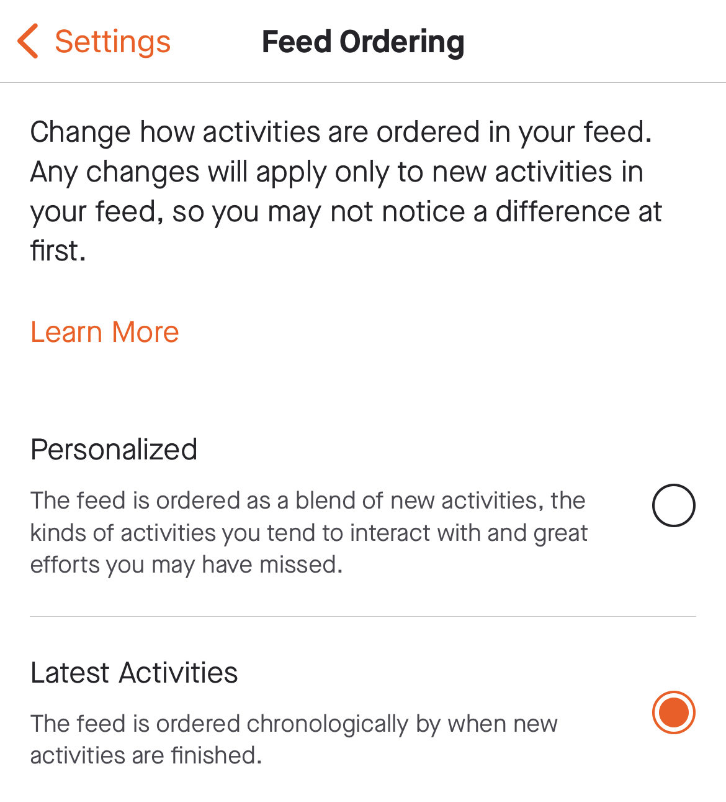

# Strava Recommended Settings

Just click in the URL to open the settings directly in the Strava app for Android/iOS/Web.

### [Profile](https://www.strava.com/settings/profile)

- Add Location

### [Preferences > Privacy Controls](https://www.strava.com/settings/privacy)

- Where You Appear  
`Profile Page`: Followers  
`Activities`: Followers  
`Group Activities`: Followers  
`Flybys`: No One  
`Local Legends`: No One  
`Mentions`: Followers  

- Additional Controls > Map Visibility  
`Hide the start and end points of activities no matter where they happen` > 400 meters hidden

- Additional Controls > Edit Past Activities  
`Get Started` > `Activity Visibility` > `Update all past activities to "Followers"` > `Update all past activities`

### [Preferences > Data Permissions](https://www.strava.com/settings/consent)

- Health-Related Data 
`Health-Related Data` > `Decline`

### [Preferences > Display Settings](https://www.strava.com/settings/display)

- Feed Ordering  
`Feed Ordering` > `Latest Activities`

